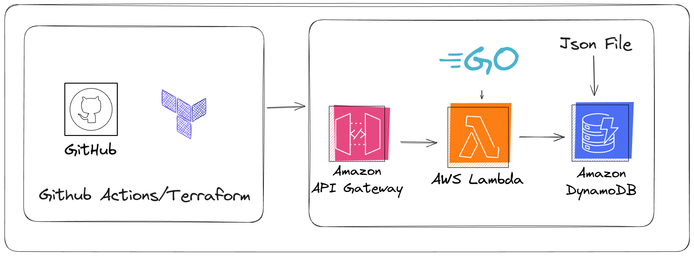

# Cloud Resume API Challenge

## Diagram

## How-To

- To invoke the API simply just click [https://ry5dzf3ztf.execute-api.us-east-1.amazonaws.com/prod/cloud-resume](https://ry5dzf3ztf.execute-api.us-east-1.amazonaws.com/prod/cloud-resume)
- If using curl `curl https://ry5dzf3ztf.execute-api.us-east-1.amazonaws.com/prod/cloud-resume`

## Links

- [Challenge-Link](https://cloudresumeapi.dev/)
